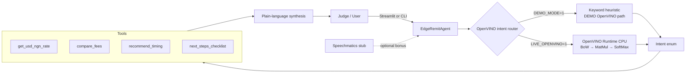

# EdgeRemit

**Nigeria remittance timing & fees assistant** with an **Intel OpenVINO** local intent router — edge compute on CPU, no cloud required for the demo path.

Built for the **AI Infra Summit Hackathon** on [lablab.ai](https://lablab.ai) — **Intel Online** track.  
Author: **Joshua Jubelo** / [Quantumwoof](https://github.com/Quantumwoof) · Nigeria.

[](LICENSE)

## Why EdgeRemit (Intel Online angle)

Remittance decisions in Nigeria are edge-shaped: spotty connectivity, sensitive questions (“should mum get $500 before Friday rent?”), and no need to ship every utterance to a remote LLM just to classify intent.

EdgeRemit keeps a **tiny intent classifier on-device** with **Intel OpenVINO Runtime (CPU)**:

| Path | When | What happens |
| --- | --- | --- |
| **DEMO OpenVINO path** | Default (`DEMO_MODE=1`) | Keyword/heuristic router that mirrors the same `Intent` enum and logs `DEMO OpenVINO path` |
| **LIVE OpenVINO path** | `LIVE_OPENVINO=1` + `DEMO_MODE=0` | OpenVINO compiles a bag-of-words → MatMul → SoftMax graph and runs inference on **CPU** |

Both paths dispatch the same remittance tools (rate, fees, wait-vs-send, checklist). Estimates are **hackathon demos**, not live quotes.

## Quick start (judges — no API keys)

```bash
git clone https://github.com/Quantumwoof/edge-remit.git
cd edge-remit
python3 -m venv .venv
source .venv/bin/activate   # Windows: .venv\Scripts\activate
pip install -r requirements.txt

# Smoke test (exits 0, no keys)
DEMO_MODE=1 python main.py --demo-once

# Primary demo UI
DEMO_MODE=1 streamlit run app.py
```

Optional LIVE OpenVINO (requires the `openvino` package from `requirements.txt`):

```bash
LIVE_OPENVINO=1 DEMO_MODE=0 python main.py --demo-once --live-openvino
LIVE_OPENVINO=1 DEMO_MODE=0 streamlit run app.py
```

## Judge demo script (~4 minutes)

1. **Hook (20s)** — “People in Nigeria don’t need another FX chart. They need: is this a good week to receive $500, Wise vs Remitly vs the bank, and what mum must send so the transfer doesn’t bounce — routed **locally** with Intel OpenVINO.”
2. **Architecture (40s)** — show the mermaid below. Point at OpenVINO intent router → four tools → Streamlit.
3. **Streamlit (2 min)** — `streamlit run app.py`. Click example #1 (rate), #2 ($500 fees), #3 (rent → send now). Sidebar shows DEMO vs LIVE OpenVINO status.
4. **CLI proof (30s)** — `DEMO_MODE=1 python main.py --demo-once`. Narrate the `[router] DEMO OpenVINO path` log lines.
5. **Close (20s)** — “Confirm the live rate in-app. EdgeRemit decides; it does not send. Optional Speechmatics STT is a bonus stub and never blocks the demo.”

Sample session: [docs/demo-transcript.md](docs/demo-transcript.md) · Slides outline: [docs/slides.md](docs/slides.md).

## Architecture



### Intents

`rate_check` · `fee_compare` · `send_now_advice` · `checklist` · `general`

### Intel OpenVINO integration

- Package: `openvino` (pinned loosely as `>=2024` in `requirements.txt`; verified on **2026.3.x**).
- LIVE path builds an `ov.Model` with opset MatMul + Add + SoftMax, `core.compile_model(..., "CPU")`, then runs BoW features.
- DEMO path is intentional for offline judging and logs **`DEMO OpenVINO path`** so the edge story is visible even without stressing the Runtime.
- If LIVE is requested but OpenVINO fails to import/compile, the agent **falls back to DEMO** and records the error in `router_status()`.

## Environment variables

| Variable | Required | Default | Purpose |
| --- | --- | --- | --- |
| `DEMO_MODE` | no | `1` unless LIVE is on | Force DEMO OpenVINO path |
| `LIVE_OPENVINO` | no | `0` | Compile & run OpenVINO CPU intent model |
| `SPEECHMATICS_API_KEY` | no | unset | Optional STT bonus stub — **demo never blocks if missing** |
| `OPENAI_API_KEY` | no | unset | Reserved / unused in MVP |

Copy `.env.example` → `.env`. **Never commit `.env`.**

## Speechmatics (optional bonus)

`src/edge_remit/speechmatics_stub.py` exposes a stub that:

- Returns a clear “key not set” message when `SPEECHMATICS_API_KEY` is missing.
- Returns a canned transcript when a key is present (MVP does not call the network so judging stays reliable).

Wire the real Speechmatics Batch/Realtime API for a production voice→intent path. Streamlit has a **Speechmatics stub** tab.

## Project layout

```
edge-remit/
  app.py                      # streamlit run app.py
  main.py                     # python main.py [--demo-once]
  requirements.txt
  .env.example
  docs/
    demo-transcript.md
    slides.md
  src/edge_remit/
    openvino_router.py        # DEMO + LIVE OpenVINO intent router
    tools.py                  # rate / fees / timing / checklist
    agent.py                  # router → tools → synthesis
    synthesizer.py
    speechmatics_stub.py
    cli.py
    config.py
```

## Smoke test

```bash
DEMO_MODE=1 python main.py --demo-once
# or
DEMO_MODE=1 python -c "from edge_remit.agent import EdgeRemitAgent; a=EdgeRemitAgent(); print(a.turn('USD to naira rate?')); assert a.last_route is not None"
```

Both exit **0** with no API keys.

## Caveats

- Fee rows and FX levels are **hackathon estimates**, labeled in UI and tool JSON. Not live operator quotes.
- Not a money-transfer operator. No payments, no KYC, no account login.
- OpenVINO LIVE weights are handcrafted for the demo vocabulary — replace with a trained export (ONNX → OpenVINO IR) for production.
- Speechmatics is optional and never required to judge.

## License

MIT — see [LICENSE](LICENSE).
